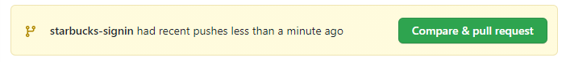

# Part 2. Git을 활용한 버전관리

## CH 1. 버전관리

### 01. 개요(Git, GitHub)
- 버전관리의 필요성
  - 기존 프로젝트에 대해 지속적인 수정사항 발생
  - 다른 개발자와의 협업
- git 설치

### 02. 스타벅스 예제 GitHub 업로드(Push)
- vs code 에서 기본 단축키 : crtl + `
  ``` bash
  $ git init # 왼쪽 하단에 master branch 생성
  $ git config --global core.autocrlf true # Mac에서는 input
  $ git config --global user.name '' # github 가입 ID로 입력
  $ git config --global user.email '' # github 가입 Email로 입력
  $ git config --list
  $ git status
  $ git add .
  $ git commit -m 'Start Project' # comment 입력
  $ git log

  # github으로 이동 후, New Repository
  # 생성 후, github 주소 복사

  $ git remote add origin  # 복사한 github 주소 입력
  $ git push origin master # origin에 master branch로 push

  # 인증단계를 거친 후 github upload가 진행됨
  # 생성했던 Github Repository로 이동 후 upload 잘 됐는지 확인
  ```
- core.autocrlf 옵션
  - Windows 에서는 line ending으로 CR(Carriage Return, \r)과 LF(Line Feed, \n)을 사용
  - Unix 계열에서는 LF만 사용
  - 이는 github merge마다 문제 발생의 소지가 있음
  - core.eol 옵션을 통해 native, crlf, lf 로 설정 가능
    ``` bash
    $ git config --global core.eol native
    ```
- core.autocrlf에는 아래와 같은 옵션으로 설정 가능
  - false(default) : 파일에 crlf, lf 관계없이 파일 그대로 checkin, checkout
  - true : text file을 obejct DB에 넣기전에 CRLF를 LF로 변경
  - input : LF을 line ending으로 사용
  - *.gitattributes* 파일을 통해서도 설정 가능하다!
  - 하지만.. git client로 egit을 사용하면 *.gitattributes* 를 읽지 못하므로 core.autocrlf 설정을 해주어야 한다! (참고로 egit은 간단하게 Eclise용 git 정도로 이해하면 되겠다)
    ``` plaintext
    # git 텍스트 파일의 속성 지정
    # Auto detect text files and perform LF normalization
    *         text=auto

    *.cs      text diff=csharp
    *.java    text diff=java
    *.html    text diff=html
    *.css     text
    *.js      text
    *.sql     text

    *.csproj  text merge=union
    *.sln     text merge=union eol=crlf

    *.docx    diff=astextplain
    *.DOCX    diff=astextplain

    # absolute paths are ok, as are globs
    /**/postinst* text eol-lf

    # paths that don't start with / are treated relative to the .gitattributes folder
    relative/path/*.txt text eol-lf
    ```

### 03. 버전 생성과 업로드의 이해
``` bash
$ git init # master branch 생성
$ git add . # stage로 올림(변경사항 추적중)
$ git commit -m 'comment' # 메세지(-m)와 함께 버전 
$ git remote add origin https://github.com ... # origin이란 별칭으로 원격 저장소 연결
$ git push origin master # origin 별칭의 연격 저장소로 버전 내역 전송
```

### 04. Netlify 지속적인 배포
- https://app.netlify.com
  - create a new site
  - continuous deployment
  - authorize netlify
  - github 페이지에서 install netlify
  - 세팅이 완료되면, public domain이 제공됨

### 05. 수정사항 버전 생성(Commit)
``` bash
# project 수정...
$ git status
$ git add .
$ git status
$ git commit -m 'comment'
$ git log
```

### 06. 로그인 브랜치(Branch)
- 보통 프로젝트를 혼자서만 하지 않기 때문에 여러 개발자들이 별도로 개발을 하고 나중에 master branch로 병합하는 방식으로 프로젝트를 진행함
  ``` bash
  $ git branch -a
  $ git branch signin # signin branch가 생성됨
  $ git branch
  $ git checkout signin # signin branch로 변경
  ```
  
### 07. 로그인 페이지 개발(1)
``` bash
# branch가 starbucks-signin인지 확인
$ git status
$ git add .
$ git status
$ git commit -m '공통 모듈 분리'
```

### 08. 로그인 페이지 개발(2)

### 09. 로그인 브랜치 병합(Pull Request)
``` bash
# branch를 원격저장소로 push
$ git push origin starbucks-signin
```
- github 저장소에 아래와 같이 추가된 branch 정보가 있는지 확인
  
- github 저장소에서 Pull requests 클릭
- New pull request 클릭
- 왼쪽은 병합대상 branch, 오른쪽은 변경 branch
- 아래 내용으로 변경사항을 확인할 수 있음
- Create pull request 클릭
  - conflict 발생시, 변경사항을 수정하여 merge conflict 가능

### 10. 프로젝트 복제(Clone)
``` bash
$ git clone ${remote git repository url}
```

### 11. 연습-버전 되돌리기(Reset)
``` bash
$ git init
$ git status
$ git add .
$ git status
$ git commit -m '1'
$ git log

# 파일 변경

$ git status
$ git commit -am '2'
$ git log

# git 버전 변경

$ git reset --hard HEAD~1  # HEAD에서 바라보는 버전 - 1로 이동
$ git reset --hard ORIG_HEAD  # 기존 HEAD로 버전 되돌리기
$ git reset --hard HEAD~2  # HEAD에서 바라보는 버전 - 2로 이동
# reset 명령어는 조심해서 다룰 것!

$ git branch purple
$ git branch
$ git checkout purple

# 파일 추가

$ git status
$ git commit -m 'purple/1'
$ git checkout master  # checkout 하면 purple branch에서 작업한 파일이 사라짐

# 파일 변경

$ git commit -m '4'

# github repository 생성
# git remote 주소 복사

$ git remote add origin ${url}
$ git push origin master

$ git checkout purple
$ git push origin purple
```

### 12. 연습-다른 환경에서 시작하기
``` bash
# 다른 PC에서 접속했다는 가정
# 위에서 push한 github url 복사

$ git clone ${url}  # master branch
$ git branch -r

# 실제 프로젝트에서는 필요한 branch만 따와서 작업하면서 관리

$ git checkout -t origin/purple
$ git branch
$ git checkout master
$ git branch -d purple  # 현재 branch를 지울 수 없으므로 다른 branch로 이동 후 제거
$ git checkout -b yellow  # branch 생성과 함께 이동
$ git push origin yellow
```

### 13. 연습-충돌(Conflict), 로컬병합(Merge)
``` bash
# 파일 수정

$ git status
$ git add .
$ git commit -m 'XYZ'
$ git push origin master


# 다른 환경에서 위에서 변경한 동일파일 수정

$ git commit -am 'ABC'  # add와 함께 commit
$ git push origin master  # local과 원격저장소가 서로 달라서 충돌 오류와 함께 종료
$ git pull origin master  # terminal에 CONFLICT 메세지가 나타남

  현재 변경 사항 수락|수신 변경 사항 수락|두 변경 사항 모두 수락|변경 사항 비교
  <<<<<<<<<<<< HEAD
    <h1>ABC</h1>
  ========
    <h1>XYZ</h1>
  >>>>>>>>>>>> eboiasdfhr26532oihg0af90gh...

# 위 충돌내용을 비교하여 어떤 것을 적용할 것인지 판단 후 수정

$ git commit -am 'ABYZ'
$ git push origin master  # 변경된 내용으로 push
```


## CH 2. Markdown

### 01. 개요
- *.md
- 장점
  - 문법이 쉽고 간결하다!
  - 관리가 쉽다!
  - 지원 가능한 플랫폼과 프로그램이 다양하다!
- 단점
  - 표준이 없다!
  - 모든 HTML 마크업을 대신하지 못한다!

### 02. 제목, 문장, 줄바꿈

### 03. 강조, 목록

### 04. 링크, 이미지

### 05. 인용문, 코드 강조

### 06. 표

### 07. 원시 HTML, 수평선

### 08. 원격 저장소에 Push
```bash
# 신규 Repository 생성 후 새 디렉토리 생성
$ git init
$ git status
$ git commit -am 'README.md 생성'
$ git remote add origin ${git url}
$ git push origin master
```
